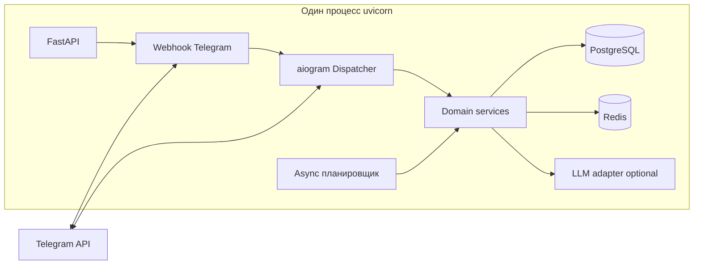

# План реализации: Telegram-бот LinguaBoost

**Ветка**: `001-telegram-language-bot` | **Дата**: 2026-04-22 | **Спека**: [spec.md](./spec.md)

**Вход**: монолит на **Python**: **aiogram 3.x** + **FastAPI** в одном процессе; **PostgreSQL** — источник истины; **Redis** — кеш и координация; фоновые задачи (логика «нового дня», напоминания) — **встроенный async-планировщик в том же процессе**, без отдельных воркеров (цель — стабильная работа одним процессом на хостинге вроде VPS/PaaS).

## Summary

Реализуем **Telegram как UI-слой** (хендлеры aiogram, клавиатуры, тексты RU), а **уроки, проверка ответов, прогресс, сценарии практики и опциональный LLM** — в **domain/backend-слое** с чёткими границами: хендлеры тонкие, бизнес-логика тестируется без Telegram.

Данные пользователей и прогресса — **PostgreSQL** (ACID, миграции). **Redis** — кеш идемпотентности апдейтов, краткоживущий state при необходимости, распределённые блокировки при масштабировании (в MVP один процесс — всё равно полезно для будущего).

**Планировщик**: один **AsyncIO-совместимый** планировщик в жизненном цикле приложения (`lifespan` FastAPI), тикающий вместе с event loop **uvicorn**; отдельные процессы Celery/RQ **не используются**.

## Technical Context

| Поле | Значение |
|------|----------|
| **Language/Version** | Python 3.11+ |
| **Primary Dependencies** | FastAPI, uvicorn, aiogram 3.x, SQLAlchemy 2.x + asyncpg, Alembic, redis (async), APScheduler 4.x (AsyncIOScheduler) или эквивалент (см. research.md), Pydantic v2 |
| **Storage** | PostgreSQL 15+; Redis 7+ (кеш, dedup, опционально rate hints) |
| **Testing** | pytest, pytest-asyncio; тесты domain-слоя без сети; интеграционные — testcontainers или docker-compose profile |
| **Target Platform** | Linux x64 (VPS/PaaS), один процесс `uvicorn` |
| **Project Type** | Монолит: веб + Telegram в одном репозитории |
| **Performance Goals** | p95 ответа бота ≤ 5 с без LLM (из спеки); LLM — отдельный бюджет и таймауты |
| **Constraints** | Один процесс на деплой; секреты только из env; логи без токенов и полного текста переписки |
| **Scale/Scope** | Пилот: сотни MAU; горизонтальное масштабирование вне MVP (при появлении второй реплики — webhook + sticky или очередь апдейтов) |

## Constitution Check

| Принцип (constitution) | Как соблюдаем |
|------------------------|---------------|
| Ясные публичные границы | Domain API (сервисы) стабильны; изменения сопровождаются тестами |
| Тестирование | Юнит-тесты движка урока/сценариев/идемпотентности; контракты на репозитории |
| Spec-driven | План и задачи трассируются к spec.md; отклонения документируются |
| Безопасность и данные | Env для `BOT_TOKEN`, `DATABASE_URL`, `REDIS_URL`, ключей LLM; удаление данных — use-case + фоновая очистка |
| Локализация / контент | UI RU; контент EN; Unicode; сообщения об ошибках понятные |

**GATE**: пройден; нарушений, требующих Complexity Tracking, нет.

## Архитектура (монолит)



- **FastAPI**: `GET /health`, `POST /telegram/webhook` (секрет в заголовке/path), опционально `GET /metrics` позже.
- **aiogram**: роутеры по командам/callback; FSM **только** для пошагового UI (онбординг, шаги урока), состояние «истины» по возможности в БД для восстановления после рестарта.
- **Domain**: `LessonService`, `PracticeScenarioEngine`, `ProgressService`, `ReminderService`, `UserSettingsService`, `LlmService` (интерфейс + реализация HTTP к провайдеру), `ContentCatalog` (загрузка YAML/JSON пакета при старте + версия в БД при необходимости).
- **Инфраструктура**: репозитории (SQLAlchemy), Redis-клиент для dedup `update_id` и кеша «текущий урок дня» по `(user_id, local_date)`.

## Планировщик (без отдельных воркеров)

- Запуск в `lifespan`: при старте — `scheduler.start()`, при остановке — graceful shutdown.
- Задачи:
  - **Напоминания**: каждые N минут (например 1–5) выборка пользователей с `reminders_enabled`, вычисление локального окна времени ±30 мин, проверка «ещё не отправляли сегодня» (ключ в Redis или строка в БД `last_reminder_local_date`).
  - **Housekeeping**: опционально раз в сутки — архивация/удаление по запросам «delete my data».
- **Не полагаться** на точность секунд: допускается джиттер в пределах интервала тика.
- При падении процесса задачи возобновляются после рестарта; идемпотентность отправки напоминаний обязательна.

## LLM

- За **фичефлагом** и настройками окружения (`LLM_ENABLED`, ключи).
- Слой **без** прямых вызовов из хендлеров: только `LlmService` с таймаутом, ретраями и обрезкой контекста.
- MVP по спеке — сценарная практика **без** LLM; LLM — расширение (подсказки, свободный диалог), не блокирует релиз.

## Деплой (один процесс)

- Команда: `uvicorn linguaboost.app.main:app --host 0.0.0.0 --port $PORT`.
- **Webhook** на публичный HTTPS URL; секрет `WEBHOOK_SECRET` проверяется в хендлере.
- **Bothost / VPS**: один контейнер или venv + systemd; PostgreSQL и Redis — управляемые сервисы или отдельные контейнеры в compose (см. quickstart.md).

## Project Structure

### Документация фичи

```text
specs/001-telegram-language-bot/
├── spec.md
├── plan.md              # этот файл
├── research.md
├── data-model.md
├── quickstart.md
└── contracts/
    └── openapi.yaml     # минимальный контракт HTTP-слоя
```

### Исходный код (репозиторий)

```text
src/linguaboost/
├── app/                 # FastAPI: main, lifespan, webhook wiring
├── bot/                 # aiogram: routers, middlewares, keyboards
├── domain/              # сервисы, чистая логика уроков/практики
├── infra/               # db (models, session), redis, repositories
├── content/             # загрузчики пакетов уроков (YAML/JSON)
├── scheduler/           # регистрация jobs (не отдельный процесс)
└── adapters/            # llm, clock (тестируемое время)

tests/
├── unit/
└── integration/
```

**Structure Decision**: один пакет `linguaboost` под hatch; граница **bot → domain → infra**; тесты **unit** на `domain` без БД где возможно, **integration** с PG/Redis в docker.

## Фазы внедрения

1. **Каркас**: FastAPI + aiogram в одном app, health, webhook, логирование структурированное (без секретов).
2. **Данные**: модели PostgreSQL, Alembic, репозитории пользователя/прогресса, Redis dedup.
3. **Онбординг + меню** (P1 UX из спеки).
4. **Мини-уроки**: загрузка контент-пакета, шаги, идемпотентность, «продолжить позже».
5. **Практика**: конечный автомат сценария, текстовый ввод.
6. **Прогресс + streak + напоминания**: планировщик, FR-009.
7. **LLM adapter** (опционально), политики таймаутов.
8. **Удаление данных**, чеклист безопасности релиза.

## Риски и смягчение

| Риск | Смягчение |
|------|-----------|
| Один процесс = единая точка отказа | Быстрый рестарт; идемпотентность; БД как источник истины |
| Планировщик нагружает БД | Батчи, индексы, кеш в Redis по кандидатам |
| Webhook flood | Очередь в памяти ограничена; backpressure через 429 Telegram — документировать |
| LLM латентность | Фичефлаг, async с таймаутом, fallback «попробуйте позже» |

## Следующий шаг

Команда **`/speckit.tasks`** — разбить план на задачи с трассировкой к `spec.md` и этому файлу.
